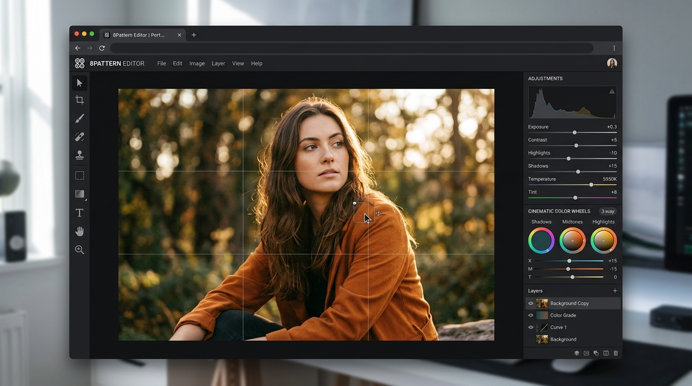
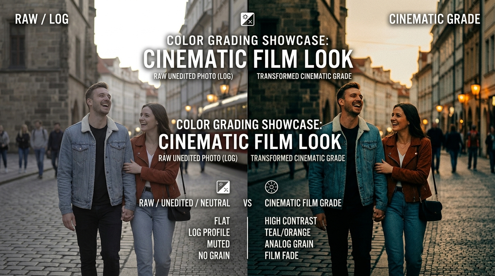
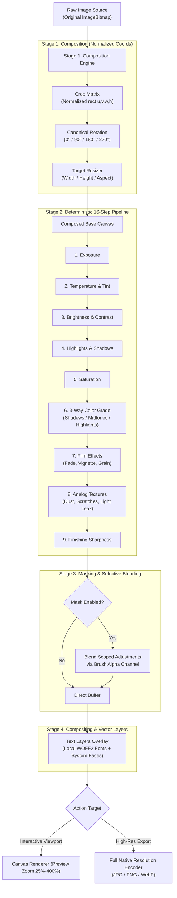
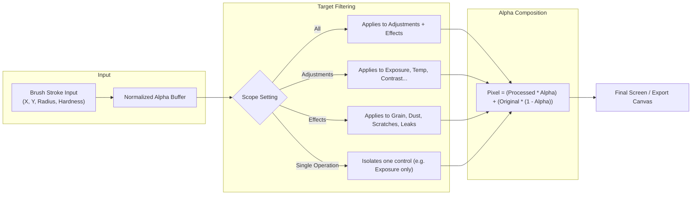
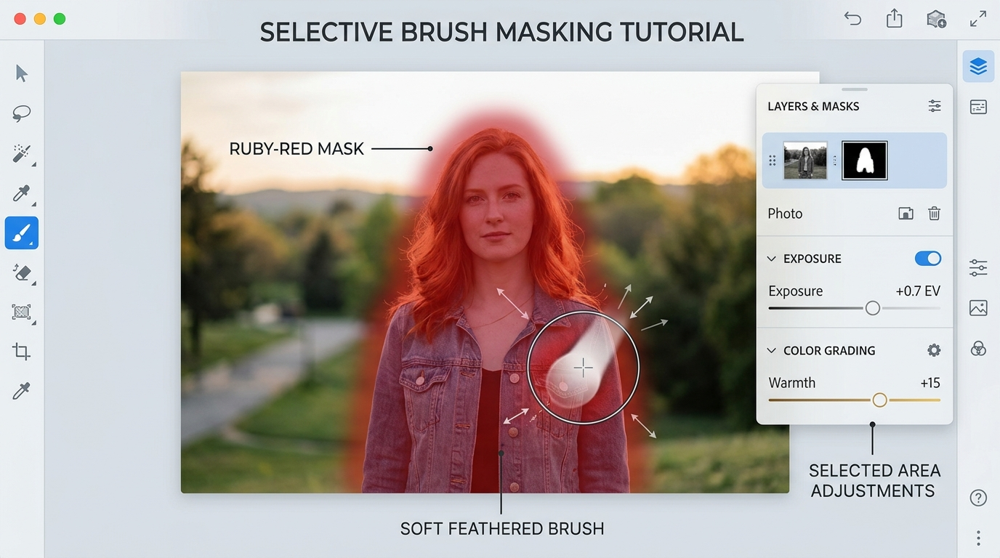

<div align="center">

# 🎞️ 8Pattern Editor
### Modern, Privacy-First Cinematic Photo Studio for the Web

[](https://github.com/arybishal/8Patterneditor)
[](LICENSE)
[](https://laravel.com)
[](https://vitejs.dev)
[](https://tailwindcss.com)
[](#)

<p align="center">
  <strong>8Pattern Editor</strong> is a professional browser-based creative photo editor tailored for cinematic color grading, 35mm analog film emulation, texture synthesis, selective brush masking, typography, and lossless export.
</p>

<p align="center">
  🔒 <strong>100% Client-Side Privacy:</strong> Your photos are processed entirely in your browser using high-performance HTML5 2D Canvas pipelines. Zero photos, masks, or metadata are ever transmitted to any remote server or cloud.
</p>

<br>

<p align="center">
  
</p>

---

[Key Features](#-key-features) • [Graphic Tutorials](#-graphic-tutorials) • [How-To Guides](#-how-to-guides-step-by-step) • [Architecture](#-rendering-pipeline--architecture) • [Keyboard Shortcuts](#-keyboard-shortcuts) • [Installation](#-installation--local-setup) • [SEO & Comparison](#-comparison--why-8pattern-editor)

---

</div>

<br>

## 🌟 Project Overview

**8Pattern Editor** was engineered to bring the tactile nuance and creative control of desktop grading suites (such as DaVinci Resolve and Adobe Lightroom) into an instant, zero-install web interface. Built with pure vanilla JavaScript components on top of a modern Laravel + Vite foundation, 8Pattern Editor eliminates heavyweight framework overhead to deliver a fluid, 60fps canvas editing experience with complete non-destructive history.

Whether you're developing high-contrast cinematic stills, emulating expired 35mm film stocks, designing editorial title cards with local WOFF2 typography, or applying selective brush adjustments, 8Pattern Editor gives you full creative agency over every pixel.

---

## 🚀 Key Features

### 🎛️ 1. Studio-Grade Tonal & Light Engine
Non-destructive 32-bit floating operations calibrated for photographic fidelity:
- **Exposure:** Precise EV adjustment simulating sensor shutter/aperture changes.
- **Brightness & Contrast:** Perceptual midtone shifts and tonal curve expansion without harsh clipping.
- **Temperature & Tint:** Full white balance correction from icy cool blues to golden hour amber, with green/magenta tint balancing.
- **Highlights & Shadows:** Intelligent recovery of blown skies and shadow extraction without raising the noise floor.
- **Saturation & Vibrance:** Smart chrominance boosting that prevents skin tone over-saturation.
- **Sharpness:** High-pass edge contrast enhancement applied at full display fidelity.

### 🎨 2. 3-Way Cinematic Color Grading
A comprehensive 3-way color system designed after cinema post-production workflows:
- **Shadows, Midtones & Highlights:** Individual hue rotation (-100 to +100) and chrominance saturation dials for 3 tonal ranges.
- **Global Look Controls:** Master grade intensity dial (0–100%), master color balance, and vibrance.
- **Split Toning:** Dedicated split tone balance, highlight warmth, and shadow coolness for instant cinematic contrast (teal/orange, cool dusk, sepia print).

### 🎞️ 3. Analog Film & Texture Emulation
Deterministic, seeded procedural generators that capture the organic feel of analog photography:
- **Film Fade:** Lifts true black levels into soft, milky film tones.
- **Vignette:** Radial falloff with soft attenuation imitating vintage optical glass.
- **Organic Film Grain:** Micro-texture grain synthesis with realistic luminance distribution.
- **Analog Dust & Specks:** Procedural micro-dust specks seeded deterministically.
- **Emulsion Scratches:** Vertical hair and mechanical scratches simulating 16mm/35mm transport wear.
- **Cinematic Light Leaks:** Warm, directional lens light spill with authentic corner falloff.

### 🖌️ 4. Selective Brush Masking
Target adjustments and effects with fine-grained local control:
- **Freehand Painting:** Dual Brush and Eraser modes.
- **Dynamic Brush Controls:** Dial in Size (1–100%), Edge Hardness (0–100%), and Opacity (1–100%).
- **Target Scoping:** Bind your mask to:
  - *All adjustments and effects*
  - *Tonal adjustments only*
  - *Cinematic effects only*
  - *Any individual parameter* (e.g., mask only Exposure or only Grain!)
- **One-Click Invert:** Invert mask polarity instantly.
- **Live Ruby Overlay:** Visual semi-transparent ruby mask preview that toggles on or off with zero impact on the final export.

### 📐 5. Composition, Crop & Aspect Ratios
- **Interactive Crop Box:** 8-point boundary handles with smooth boundary clamping.
- **Aspect Ratio Presets:** `Free`, `Original`, `1:1` (Square), `4:5` (Social portrait), `3:4` (Classic print), and `16:9` (Cinematic widescreen).
- **Canonical Rotation:** True 90° lossless clockwise and counter-clockwise rotations preserving aspect integrity.
- **Output Resizing:** Custom target width and height configuration with optional aspect ratio preservation.

### ✍️ 6. Studio Typography Engine
- **21 Bundled Google Fonts in WOFF2:** High-fidelity fonts stored locally with zero external network requests (Anton, Bebas Neue, Caveat, Dancing Script, Inter, JetBrains Mono, Lato, Libre Baskerville, Lora, Merriweather, Montserrat, Nunito, Open Sans, Oswald, Playfair Display, Poppins, Quicksand, Raleway, Roboto, Rubik, Space Mono).
- **5 System Fonts:** Inter, Arial, Georgia, Times New Roman, and Courier New.
- **Full Text Styling:** Multi-layer support, color picker, opacity, weight selection (400–700), normal/italic styles, letter spacing (tracking), line height, and alignments.
- **Canvas Dragging:** Direct click-and-drag positioning directly on the photo.

### 🕒 7. Non-Destructive History & Snapshots
- **Interactive History Panel:** Visual timeline listing every discrete operation (e.g., `Exposure +15`, `Rotate 90°`, `Apply Preset: Warm Film`).
- **One-Click Time Travel:** Jump backwards or forwards to any previous editing state without loss of intermediate data.
- **Zero-Memory State Representation:** Snapshots serialize compact delta parameters—never cloning large pixel buffers in memory.

### 💾 8. Ultra High-Resolution Export
- **Formats:** `JPG` (with 10–100% compression quality dial), `PNG` (lossless 24-bit RGB), and `WebP` (modern high-efficiency format).
- **Native Resolution:** Renders against the original uploaded source dimensions (supporting ultra-high resolutions up to 60 Megapixels / 16,384px).
- **Clean Safe Filenames:** Automatically sanitizes output file names (`photo-edited.jpg`).

### 📁 9. Project Files, Custom Looks & Session Recovery
- **Portable Project Files (`.8pattern.json`):** Export and import your complete editing recipe as a lightweight JSON file. Share grading formulas, crop settings, text layers, and brush strokes with others without transferring large image files.
- **Custom Browser Looks:** Save your own favorite grading formulas with a custom name directly in your browser (up to 30 custom presets). Apply, rename, or delete saved looks anytime.
- **Session Auto-Recovery:** Automatic state preservation protects against accidental tab closures or page reloads with a seamless "Restore previous session" prompt.

---

## 🎨 Curated Cinematic Presets

8Pattern Editor includes a curated collection of handcrafted presets that set up full looks with a single click:

| Preset Name | Style & Characteristics | Ideal For |
|:---|:---|:---|
| **Clean** | Neutral baseline with zero color cast | Reference & baseline |
| **Warm Film** | Lifted shadows, warm amber highlights (+35), subtle 14% grain | Golden hour portraits, travel |
| **Cool Film** | Deep cool cyan shadows (+40), reduced saturation, crisp contrast | Rainy streets, architectural photography |
| **Vintage Print** | Faded blacks (30%), 22% grain, dust specks, and warm paper tint | Retro aesthetics, nostalgic landscapes |
| **Cinematic Contrast** | Rich punchy blacks (+28 contrast), split-toned shadows (+25 coolness) | Neo-noir, street photography |
| **Faded Cinema** | 45% black level lift, subdued chrominance (-12%), subtle vignette | Documentary, editorial stills |
| **Faded Film** | Classic soft contrast curve with light analog scratches | Everyday snapshot character |
| **Vintage** | Heavy analog patina with dust, scratches, and warm light leak | 70s / 80s film emulation |

---

## 📊 Graphic Tutorials

### 1. Cinematic Color Grading: Raw/Flat vs. Graded Film Look
Below is a demonstration of how 8Pattern Editor transforms a flat, neutral RAW photograph into a rich, atmospheric cinematic still using 3-way color wheels, split toning, and analog grain:

<p align="center">
  
</p>

---

### 2. Workspace Layout Map
```text
+-----------------------------------------------------------------------------------------+
| [8P] 8Pattern Editor   |  IMG_2026.jpg (4032 x 3024)   | [Undo] [Redo] [Open] [Reset] [Panel] |
+-----------------------------------------------------------------------------------------+
| TOOLRAIL  |                               WORKSPACE                               |   PANEL   |
|-----------|-----------------------------------------------------------------------|-----------|
| [Adjust]  |                                                                       | [HISTORY] |
| [Film]    |                                                                       |  o Bright |
| [Effects] |                       +-----------------------+                       |  * Split  |
| [Mask]    |                       |                       |                       |  . Init   |
| [Crop]    |                       |    [EDITOR CANVAS]    |                       |-----------|
| [Rotate]  |                       |                       |                       | CONTROLS: |
| [Text]    |                       |  Interactive Viewport |                       | Exposure  |
| [Export]  |                       |  with Pan & Zoom      |                       | [----o--] |
|           |                       +-----------------------+                       | Contrast  |
|           |                                                                       | [--o----] |
|           |                                                                       | Temp      |
|           |                                                                       | [------o] |
+-----------------------------------------------------------------------------------------+
| Ready - open a photo to start editing.                         | [-]  100%  [+]  [Fit]    |
+-----------------------------------------------------------------------------------------+
| 8Pattern Editor  *  Proudly built with love in Nepal  *  Version 1.0 Beta               |
+-----------------------------------------------------------------------------------------+
```

---

### 3. Image Processing & Rendering Pipeline
Every render follows a deterministic multi-stage architecture. The composed source feeds through tonal processing, color grading, analog effects, and text compositing:



---

### 4. Mask Scoping & Targeted Blending Architecture



---

## 📖 How-To Guides (Step-by-Step)

### 📸 Tutorial 1: Opening an Image & Making Basic Adjustments
1. Click **"Open photo"** in the top bar or click the **"Upload Image"** button in the canvas center.
2. Select any local `JPG`, `PNG`, or `WebP` file.
3. Your photo opens in the viewport fitted to your screen automatically.
4. On the left **Toolrail**, select **Adjust** (top icon).
5. Drag sliders to adjust:
   - **Exposure:** Brighten dark scenes or pull down blown skies.
   - **Temperature:** Slide right for warm sunset tones, slide left for cooler tones.
   - **Contrast & Shadows:** Deepen your blacks or rescue shadow detail.
6. Click the **↺** button next to any slider to reset that individual parameter back to 0.

---

### 🎬 Tutorial 2: Creating a Moody Cinematic Film Look
1. Select the **Film** / **Effects** tool from the toolrail.
2. Under the **Presets** section, click **"Cinematic Contrast"** or **"Warm Film"**.
3. Fine-tune your texture:
   - Increase **Film Grain** to `15–25%` for organic 35mm film grit.
   - Increase **Fade** to `20–30%` to lift the deep blacks for a matte film print appearance.
   - Add `15%` **Vignette** to draw viewer focus toward the center of your frame.
4. Switch to the **Adjust** tool and scroll to the **Cinematic** section:
   - Increase **Highlight Warmth** (+20) and **Shadow Coolness** (+30) for a classic blockbuster split tone.

---

### 🖌️ Tutorial 3: Using Selective Brush Masking

<p align="center">
  
</p>

1. Select the **Mask** tool from the toolrail.
2. Click **"New Mask"** to initialize a fresh brush layer.
3. Configure your brush:
   - Set **Size** according to the area you wish to paint.
   - Lower **Hardness** (e.g. `20–40%`) for a smooth feather at the stroke boundaries.
   - Keep **Opacity** at `100%` for full influence.
4. Paint over the subject on the canvas (e.g. a portrait subject or sky). A semi-transparent red overlay indicates your painted mask area.
5. In the **"Apply to"** dropdown, select **"Exposure"** or **"Adjustments only"**.
6. Switch to the **Adjust** tool and change **Exposure** or **Brightness**. Notice how *only* the painted region changes!
7. To edit the background instead, return to **Mask** and click **"Invert"**.
8. Uncheck **"Show mask overlay"** to preview your photo cleanly.

---

### 📐 Tutorial 4: Cropping & Composition
1. Select the **Crop** tool from the toolrail.
2. Choose an aspect ratio from the preset bar:
   - **1:1** for square avatars or Instagram feed posts.
   - **4:5** for vertical social media portraits.
   - **16:9** for cinematic widescreen wallpapers and banners.
   - **Free** for unrestricted custom cropping.
3. Drag the corner handles on the canvas to frame your subject.
4. Click **"Apply Crop"** to commit the crop. (All crops are non-destructive and can be undone or reset at any time with **"Reset Crop"**).

---

### ✍️ Tutorial 5: Adding Studio Typography
1. Select the **Text** tool from the toolrail.
2. Click **"Add text"**. A new text layer appears centered on your image.
3. Type your custom heading or caption in the text box.
4. Select from the **21 curated local Google Fonts** (e.g., *Playfair Display* for luxury editorial, *Bebas Neue* for cinematic film posters, or *JetBrains Mono* for a tech look).
5. Adjust **Size**, **Color**, **Tracking** (letter spacing), and **Line height**.
6. Click and drag the text directly on the canvas to reposition it anywhere on your photo.

---

### 💾 Tutorial 6: Exporting Full-Resolution Files
1. Select the **Export** tool from the toolrail.
2. Choose your preferred output format:
   - **JPG:** Ideal for general photography with minimal file size (set Quality slider between 85% and 95%).
   - **PNG:** Lossless compression with no artifacts, perfect for graphics and typography.
   - **WebP:** Modern web format combining superior compression with photographic quality.
3. Review the indicated output dimensions (rendered at full native image resolution).
4. Click **"Export"**. The image is rendered and downloaded directly to your computer!

---

## ⚡ Comparison: Why 8Pattern Editor?

| Feature | 8Pattern Editor | Adobe Lightroom Web | Canva | Standard Web Editors |
|:---|:---:|:---:|:---:|:---:|
| **Zero Server Uploads (Privacy)** | ✅ **100% Client-Side** | ❌ Cloud Upload Required | ❌ Cloud Upload Required | ⚠️ Often Uploads |
| **3-Way Color Wheels** | ✅ **Yes (Cinema Grade)** | ✅ Yes | ❌ Basic Filters Only | ❌ Rare |
| **Analog Texture Synthesis** | ✅ **Grain, Dust, Scratches, Leaks** | ⚠️ Grain Only | ❌ Overlays Only | ❌ Rare |
| **Selective Brush Masking** | ✅ **Included Free** | 💰 Premium Subscription | 💰 Premium Subscription | ❌ Rare |
| **Local Offline WOFF2 Fonts** | ✅ **21 Bundled Fonts** | ❌ Cloud Synced | ❌ Cloud Synced | ⚠️ System Fonts Only |
| **No Account / No Paywall** | ✅ **100% Free & Open Source** | ❌ Subscription Required | ❌ Freemium / Watermarked | ⚠️ Ad-Supported |
| **High-Res Native Export (60MP)** | ✅ **Lossless Full-Res** | ⚠️ Compression Caps | 💰 Paywalled High-Res | ⚠️ Downscaled |

---

## 🔍 SEO & Use Cases

8Pattern Editor is built for creative professionals, developers, and casual photographers:
- **Photographers & Retouchers:** Quick, color-accurate adjustments and split-toning without launching resource-heavy software.
- **Cinematographers & Colorists:** Instant film emulation testing (35mm grain, color balance, matte black fade).
- **Social Media Creators:** Exporting pixel-perfect 4:5 Instagram portraits or 16:9 cinematic YouTube thumbnails with typography.
- **Privacy-Conscious Users:** Edit private or sensitive documents and personal family photographs knowing no image data ever touches an external server.

---

## ⌨️ Keyboard Shortcuts

| Shortcut | Action | Description |
|:---|:---|:---|
| <kbd>Ctrl</kbd> + <kbd>Z</kbd> | **Undo** | Step backward in the history stack |
| <kbd>Ctrl</kbd> + <kbd>Shift</kbd> + <kbd>Z</kbd> | **Redo** | Step forward in the history stack |
| <kbd>Ctrl</kbd> + <kbd>Y</kbd> | **Redo** | Alternative redo shortcut |
| <kbd>+</kbd> (Zoom Control) | **Zoom In** | Increment canvas zoom scale |
| <kbd>-</kbd> (Zoom Control) | **Zoom Out** | Decrement canvas zoom scale |
| **Fit** | **Fit to Screen** | Auto-scale viewport to fit current image |

---

## 🛠️ Technology Stack

- **Backend / Scaffolding:** [Laravel 11](https://laravel.com) (PHP 8.2+)
- **Build Tool & Bundler:** [Vite 6](https://vitejs.dev)
- **Styling:** [Tailwind CSS 4](https://tailwindcss.com) with bespoke studio dark-theme CSS (`editor.css`)
- **Rendering Engine:** HTML5 2D Canvas API with offscreen multi-buffer pixel pipelines
- **Typography:** Local WOFF2 font distribution with dynamic `FontFace` API lazy loading
- **Package Management:** Composer & NPM

---

## 📂 Project Architecture

```text
8Patterneditor/
├── app/                      # Laravel application core
├── bootstrap/                # Application bootstrap & providers
├── config/                   # Laravel configuration files
├── docs/                     # Documentation & visual graphic resources
│   └── images/               # High-resolution screenshots, mockups & tutorials
├── public/                   # Public web root
│   ├── fonts/                # 21 Local WOFF2 font families + manifest.json
│   ├── favicon.ico           # Application favicon
│   ├── favicon.svg           # High-resolution vector favicon
│   └── index.php             # Web entry point
├── resources/
│   ├── css/
│   │   ├── app.css           # Base Tailwind directives
│   │   └── editor.css        # Studio dark theme & editor UI styling
│   ├── js/
│   │   ├── app.js            # Editor application bootstrapper
│   │   └── editor/
│   │       ├── canvas/       # CanvasRenderer (viewport, RAF rendering, pan/zoom)
│   │       ├── color/        # ColorGradeEngine & 3-way color grading state
│   │       ├── composition/  # CompositionRenderer & interactive CropController
│   │       ├── export/       # High-res client-side export encoder
│   │       ├── fonts/        # FontManager, FontCatalog & local FontFace loader
│   │       ├── history/      # HistoryManager & HistorySnapshot serialization
│   │       ├── masking/      # MaskController, MaskRenderer & brush engine
│   │       ├── pipeline/     # AdjustmentPipeline, operations, effects & texture
│   │       ├── state/        # EditorState (single source of truth)
│   │       ├── text/         # TextController, TextRenderer & TextState
│   │       ├── tools/        # Tool definitions and configuration
│   │       └── ui/           # EditorUI, UploadController, ZoomController
│   └── views/
│       └── editor.blade.php  # Main editor studio Blade layout
├── routes/
│   └── web.php               # Application route definitions
├── scripts/
│   └── import-fonts.mjs      # Google Fonts WOFF2 CLI importer utility
├── .env.example              # Environment template
├── composer.json             # PHP dependencies
├── package.json              # JavaScript dependencies & build scripts
└── vite.config.js            # Vite build configuration
```

---

## 💻 Installation & Local Setup

Follow these steps to run 8Pattern Editor on your local machine:

### Prerequisites
- **PHP** >= 8.2
- **Composer** (PHP dependency manager)
- **Node.js** >= 18.x and **npm**

### Step 1: Clone the Repository
```bash
git clone https://github.com/arybishal/8Patterneditor.git
cd 8Patterneditor
```

### Step 2: Install PHP Dependencies
```bash
composer install
```

### Step 3: Install Node Dependencies
```bash
npm install
```

### Step 4: Configure Environment
```bash
cp .env.example .env
php artisan key:generate
```

### Step 5: Build Assets & Start Development Server
In one terminal, start the Vite development bundler:
```bash
npm run dev
```

In a second terminal, start the Laravel server:
```bash
php artisan serve
```

### Step 6: Access the Studio
Open your browser and navigate to:
```text
http://127.0.0.1:8000
```

---

## 🔤 Local Font Importer Utility

8Pattern Editor ships with a built-in development CLI utility to import Google Fonts directly into local WOFF2 files:

```bash
# Import one or more families locally
npm run fonts:import -- "Playfair Display" "Cinzel"

# Browse available Google Fonts (requires GOOGLE_FONTS_API_KEY in .env)
npm run fonts:import -- --list --search=vintage
```

All downloaded fonts are automatically stored in `public/fonts/` and registered into `manifest.json`.

---

## 🤝 Contributing

Contributions, feature suggestions, and bug reports are welcome!
1. Fork the Project.
2. Create your Feature Branch (`git checkout -b feature/AmazingFeature`).
3. Commit your Changes (`git commit -m 'Add some AmazingFeature'`).
4. Push to the Branch (`git push origin feature/AmazingFeature`).
5. Open a Pull Request.

---

## 📜 License

This project is open-sourced software licensed under the **[MIT License](LICENSE)**.

---

<div align="center">
  <sub>Designed and built with ❤️ in <strong>Nepal</strong> by <strong>Bishal Aryal</strong>.</sub>
</div>
